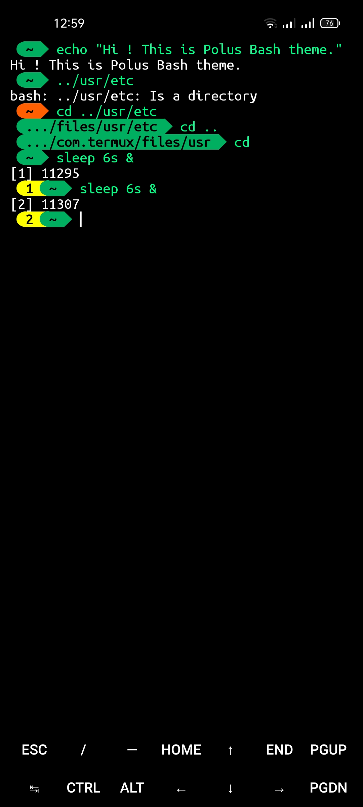

# polus-bash-theme
Polus is a simple bash theme. Please contribute to this repository for a better prompt
# Installation
```
mkdir -p ~/.bash_themes
curl -L https://raw.githubusercontent.com/rashed145/polus-bash-theme/main/polus.bash_theme -o ~/.bash_themes/polus.bash_theme
echo "source ~/.bash_themes/polus.bash_theme"| tee -a ~/.bashrc
```
# Font to use
I recommend UbuntuMono Nerd Font for this theme.
You can use any other Nerd Font you like.
But Nerd Font is recommended.

[Download UbuntuMono Nerd Font](https://github.com/ryanoasis/nerd-fonts/blob/v2.2.2/patched-fonts/UbuntuMono/Regular/complete/Ubuntu%20Mono%20Nerd%20Font%20Complete.ttf?raw=true)

# Install UbuntuMono Nerd Font in termux
```
mkdir -p ~/.termux ~/.fonts
curl -L https://github.com/ryanoasis/nerd-fonts/blob/v2.2.2/patched-fonts/UbuntuMono/Regular/complete/Ubuntu%20Mono%20Nerd%20Font%20Complete.ttf?raw=true -o ~/.fonts/UbuntuMono.ttf
ln -sf ~/.fonts/UbuntuMono.ttf ~/.termux/font.ttf
termux-reload-settings
```
# Screenshot

