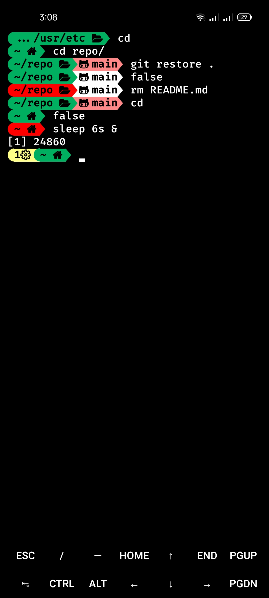

# polus-bash-theme
***Polus** is a fast and modern bash theme. It is very lightweight and completely written in bash without additional dependencies. It has less than 100 lines of code.*
# Installation
``` bash
sed -i '\,\. ~/.config/bash/themes/polus.bash-theme,d' ~/.bashrc
curl -fsSL https://raw.githubusercontent.com/rashed145/polus-bash-theme/master/polus.bash-theme -o ~/.config/bash/themes/polus.bash-theme --create-dirs
echo "[ -r ~/.config/bash/themes/polus.bash-theme ] && . ~/.config/bash/themes/polus.bash-theme"| tee -a ~/.bashrc
```
# Customization
Just edit the variables in the polus.bash-theme file according to your needs.
You can customize the time format using `PTMFMT` variable.
### Available options
Option | Description
-- | --
\t | the current time in 24-hour HH:MM:SS format
\T | the current time in 12-hour HH:MM:SS format
\@ | the current time in 12-hour am/pm format
\A | the current time in 24-hour HH:MM format

# Font to use
[Nerd Font](https://nerdfonts.com) is recommended.

# Screenshots


