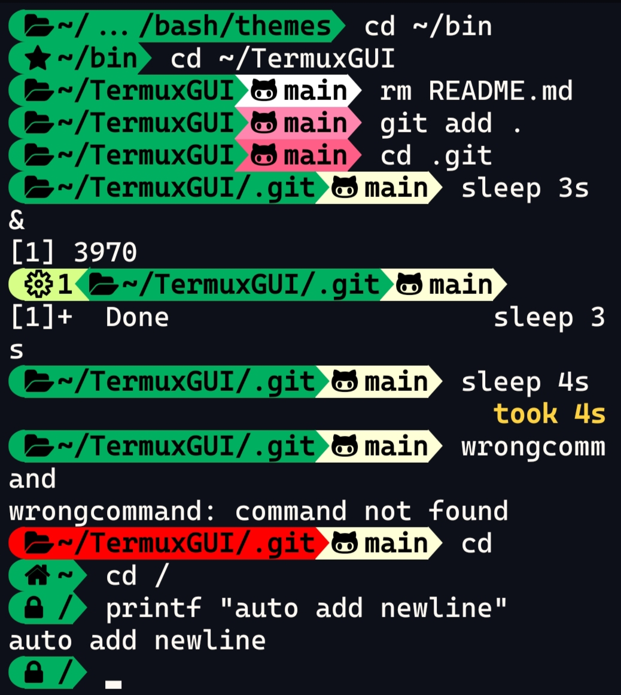

# polus-bash-theme
Polus is a fast and modern bash theme. It is very lightweight and completely written in bash without additional dependencies. It has less than 50 lines of code.
# Installation
```
sed -i '\,\. ~/.config/bash/themes/polus.bash-theme,d' ~/.bashrc
curl -fsSL https://raw.githubusercontent.com/rashed145/polus-bash-theme/master/polus.bash-theme -o ~/.config/bash/themes/polus.bash-theme --create-dirs
echo "[ -r ~/.config/bash/themes/polus.bash-theme ] && . ~/.config/bash/themes/polus.bash-theme"| tee -a ~/.bashrc
```
# Customization
Just edit the variables in the polus.bash-theme file according to your needs.
# Font to use
I recommend Hack Nerd Font for this theme.
You can use any other Nerd Font you like.
But Nerd Font is recommended.

[Download Hack Nerd Font](https://github.com/ryanoasis/nerd-fonts/blob/v2.2.2/patched-fonts/Hack/Regular/complete/Hack%20Regular%20Nerd%20Font%20Complete.ttf?raw=true)

# Install Hack Nerd Font in termux
```
curl -L https://github.com/ryanoasis/nerd-fonts/blob/v2.2.2/patched-fonts/Hack/Regular/complete/Hack%20Regular%20Nerd%20Font%20Complete.ttf?raw=true -o ~/.termux/.fonts/Hack.ttf --create-dirs
ln -sf ~/.termux/{.fonts/Hack.ttf,font.ttf}
termux-reload-settings
```
# Screenshots


#
Facebook: [Rashedul Hasan Rafi](https://www.facebook.com/profile.php?id=100088194283934&mibextid=ZbWKwL)
